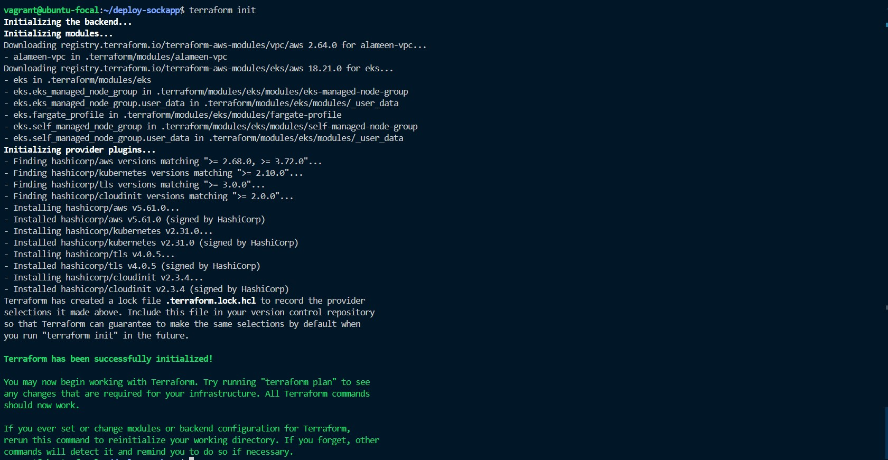
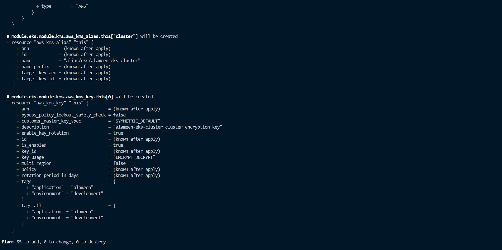
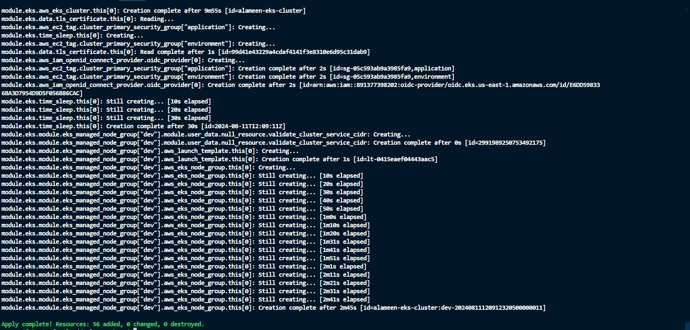

# Deployment of Socks Shop, a microservices-based application, on Kubernetes using Infrastructure as Code (IaaC).

## Project Overview:
We aim to deploy a microservices-based application, specifically the Socks Shop, using a modern approach that emphasizes automation and efficiency. The goal is to use Infrastructure as Code (IaaC) for rapid and reliable deployment on Kubernetes.
The main task is to set up the Socks Shop application, a demonstration of a microservices architecture, available on GitHub. Using tools and technologies that automate the setup process, ensuring that the application can be deployed quickly and consistently.

## Architecture:

graph LR
A[AWS] --> B(Route53)
A --> C(EKS Cluster)
    C --> D{Node Group (t3.small)}
    C --> D{Node Group (t3.small)}
C --> E(Terraform)
E --> F(Kubernetes)
F --> G(Socks Shop)
F --> H{Prometheus}
F --> I{Grafana}
B --> J(Public Internet)
J --> F
K(CI/CD Pipeline) --> E

### Explanation:

1. This architecture utilizes AWS services: Route53 for domain management, EKS for the Kubernetes cluster, and IAM for authentication (not explicitly shown).
2. The EKS cluster uses two node groups of t3.small instance types.
3. Terraform manages the infrastructure resources.
4. The Kubernetes cluster hosts the Socks Shop application, Prometheus for monitoring, and Grafana for visualization.
5. The public internet can access the application through a domain hosted on Route53, which routes traffic to the ingress on the Kubernetes cluster.
6. A CI/CD pipeline automates deployments using Terraform and Helm charts.

## Project prerequisites:

-The following has to be installed/configured;
Terraform
AWS Account
AWS cli
Kubernetes
Kubectl
Helm
Prometheus & grafana installed with helm 
ELK Stack
Let's Encrypt

## Deployment Steps:
1. Configure AWS CLI: Set up AWS credentials and configure the AWS CLI for interacting with AWS services.

2. Terraform Configuration:
    - Create a directory "terraform" to keep all teraform configuration files;
    You can get configuration commands for each file from the official terraform documentation.

    ```bash
    mkdir terraform
    cd terraform
    ```
    - Define VPC resources (network, subnets, security groups) in vpc.tf file.

    ```bash
    touch vpc.tf
    ```
    - Define the EKS cluster configuration (node groups, IAM roles) in eks-cluster.tf.

    ```bash
    touch eks-cluster.tf
    ```

    - Use variables in terraform.tfvars to customize resource settings.

3. Run Terraform: 
    -Use terraform init and terraform apply to provision the infrastructure.
    ```bash
    terraform init
    ```
    
    
     ```bash
    terraform plan
    ```
    

     ```bash
    terraform apply --auto-approve
    #the flag --auto-approve can be added to avoid the prompt for confirmation.
    ```
    

4. Kubernetes Configuration:
    -Create a folder to keep all kubernetes configuration files.

     ```bash
    mkdir kubernetes
    ```
    -keep both deployment.yaml and ingress.yaml files in the directory.

    -configure the kubectl to connect to the EKS cluster, the specified region and the cluster name.
      ```bash
    aws eks update-kubeconfig --name=alameen-eks-cluster --region=us-east-1
    ```
    -After the infrastructure has been provisioned, run the command to deploy with kubernetes

     ```bash
    kubectl apply -f deployment.yaml
    ```

Helm Charts: Deploy the Socks Shop application and monitoring tools (Prometheus, Grafana) using Helm charts.
Ingress: Configure an Ingress resource to route traffic to the application based on the domain name hosted on Route53.
CI/CD Pipeline: Set up a CI/CD pipeline using GitHub Actions to automate infrastructure provisioning and application deployments triggered by code changes.

