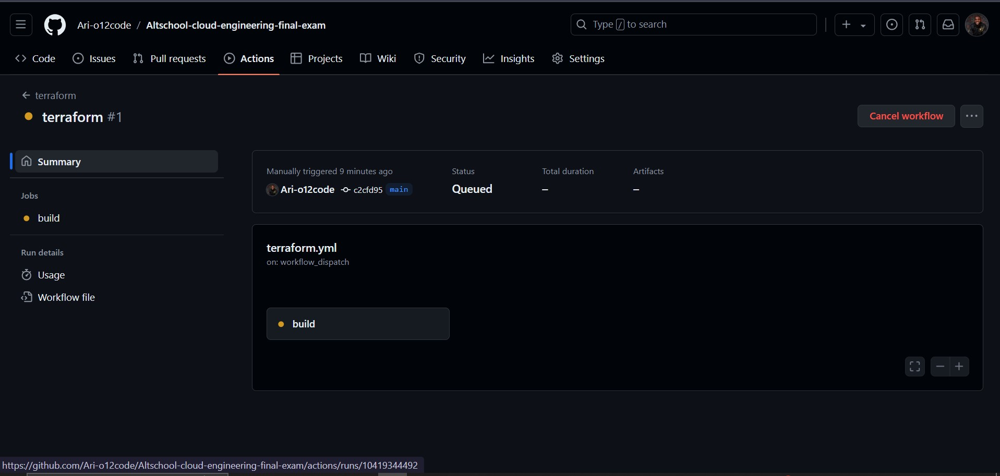

# Altschool Cloud Engineering Capstone Project: Deployment of Socks Shop, a microservices-based application, on Kubernetes using Infrastructure as Code (IaaC).

## Project Overview:
We aim to deploy a microservices-based application, specifically the Socks Shop, using a modern approach that emphasizes automation and efficiency. The goal is to use Infrastructure as Code (IaaC) for rapid and reliable deployment on Kubernetes.
The main task is to set up the Socks Shop application, a demonstration of a microservices architecture, available on GitHub. Using tools and technologies that automate the setup process, ensuring that the application can be deployed quickly and consistently.

## Architecture:
```
graph LR
A[AWS] --> B(Route53)
A --> C(EKS Cluster)
    C --> D{Node Group (t3.small)}
    C --> D{Node Group (t3.small)}
C --> E(Terraform)
E --> F(Kubernetes)
F --> G(Socks Shop)
F --> H{Prometheus}
F --> I{Grafana}
B --> J(Public Internet)
J --> F
K(CI/CD Pipeline) --> E
```
### Explanation:

1. This architecture utilizes AWS services: Route53 for domain management, EKS for the Kubernetes cluster, and IAM for authentication (not explicitly shown).
2. The EKS cluster uses two node groups of t3.small instance types.
3. Terraform manages the infrastructure resources.
4. The Kubernetes cluster hosts the Socks Shop application, Prometheus for monitoring, and Grafana for visualization.
5. The public internet can access the application through a domain hosted on Route53, which routes traffic to the ingress on the Kubernetes cluster.
6. A CI/CD pipeline automates deployments using Terraform and Helm charts.

## Project prerequisites:

-The following has to be installed/configured;
1. Terraform
2. AWS Account
3. AWS cli
4. Kubernetes
5. Kubectl
6. Helm
7. Prometheus & grafana installed with helm 
8. ELK Stack
9. Let's Encrypt

## Deployment Steps:
1. Configure AWS CLI: Set up AWS credentials and configure the AWS CLI for interacting with AWS services.

2. Terraform Configuration:
    - Create a directory "terraform" to keep all teraform configuration files;
    You can get configuration commands for each file from the official terraform documentation.

    ```bash
    mkdir terraform
    cd terraform
    ```
    - Define VPC resources (network, subnets, security groups) in vpc.tf file.

    ```bash
    touch vpc.tf
    ```
    - Define the EKS cluster configuration (node groups, IAM roles) in eks-cluster.tf.

    ```bash
    touch eks-cluster.tf
    ```

    - Use variables in terraform.tfvars to customize resource settings.

3. Run Terraform: 
    -Use terraform init and terraform apply to provision the infrastructure.
    ```bash
    terraform init
    ```
    
    
     ```bash
    terraform plan
    ```
    

     ```bash
    terraform apply --auto-approve
    #the flag --auto-approve can be added to avoid the prompt for confirmation.
    ```
    

    Below are images of my eks cluster, vpc and ec2 instances provisioned by terraform:

    
    
    

4. Kubernetes Configuration:
    -Create a folder to keep all kubernetes configuration files.

     ```bash
    mkdir kubernetes
    cd kubernetes
    ```
    -keep both deployment.yaml and ingress.yaml files in the directory.

    -configure the kubectl to connect to the EKS cluster, the specified region and the cluster name.

      ```bash
    aws eks update-kubeconfig --name=alameen-eks-cluster --region=us-east-1
    ```
    -After the infrastructure has been provisioned, run the command to deploy with kubernetes

     ```bash
    kubectl apply -f deployment.yaml
    ```
    

5. Displaying front-end of Application:
    -ingress-nginx chart can be installed with helm, this helps us create a loadbalancer 

    -After that has been created, we would specify a domain name hosted in aws route53 within our ingress file configurations where the front-end can be displayed

    -we then run kubectl command below to apply changes;

    ```bash
    kubectl apply -f ingress.yaml
    ```
    * **Below are images of our front-end displayed:**
    
    

6. CI/CD Pipeline:
    CI/CD Pipeline will be set up using GitHub Actions to automate infrastructure provisioning and application deployments triggered by code changes.
    

7. Monitoring:

    - Monitoring tools (Prometheus & Grafana) will be installed using helm after first adding the prometheus repo to our project from artifacthub;

    - Run the command to install helm:

    ```bash
    helm install prometheus-community --namespace sock-shop prometheus-community/kube-prometheus-stack
    ```

    

    -Both prometheus and grafana can be added to the configurations of the ingress.yaml file and hosted on aws route53.

    * **They can then be accessed as shown below;**

    -Prometheus:

    

    -Grafana:

    

    You can use the command below to get running services on kubernetes:
    ```bash
    kubectl get svc -n sock-shop
    ```
    

8. Security:

The application will be secured with HTTPS using a Let's Encrypt certificate. Let's Encrypt is a free, automated, and open certificate authority that provides free SSL/TLS certificates for websites. The certificate will be used to secure the communication between the client and the Socks-Shop application, ensuring that the data is encrypted and secure.

## Conclusion

This README document has provided a comprehensive overview of the Socks Shop microservices application deployment on Kubernetes using Infrastructure as Code (IaC). We have covered the key components, architecture, and steps involved in setting up the project.

**Key Takeaways:**

* **Infrastructure as Code:** Terraform was used to automate the provisioning of infrastructure resources on AWS, including the EKS cluster, VPC, and other necessary components.
* **Microservices Architecture:** The Socks Shop application is a collection of microservices deployed on Kubernetes, enabling scalability and flexibility.
* **Monitoring and Alerting:** Prometheus and Grafana were integrated to provide robust monitoring and visualization of application metrics.
* **CI/CD Pipeline:** The use of a CI/CD pipeline (GitHub Actions) automated the deployment process, ensuring consistency and efficiency.
* **Security:** Best practices for security were considered, including the use of HTTPS with Let's Encrypt and potential network perimeter security measures.

**Future Enhancements:**

* **Scaling:** Implement automated scaling mechanisms to adjust application resources based on load.
* **Service Mesh:** Explore the use of a service mesh like Istio for advanced traffic management and observability.
* **Additional Monitoring:** Consider adding more metrics and dashboards to gain deeper insights into application performance.
* **Security Best Practices:** Continuously review and update security measures to address evolving threats.

By following the steps outlined in this README and considering the future enhancements, you can further improve the deployment and management of the Socks Shop application on Kubernetes.


